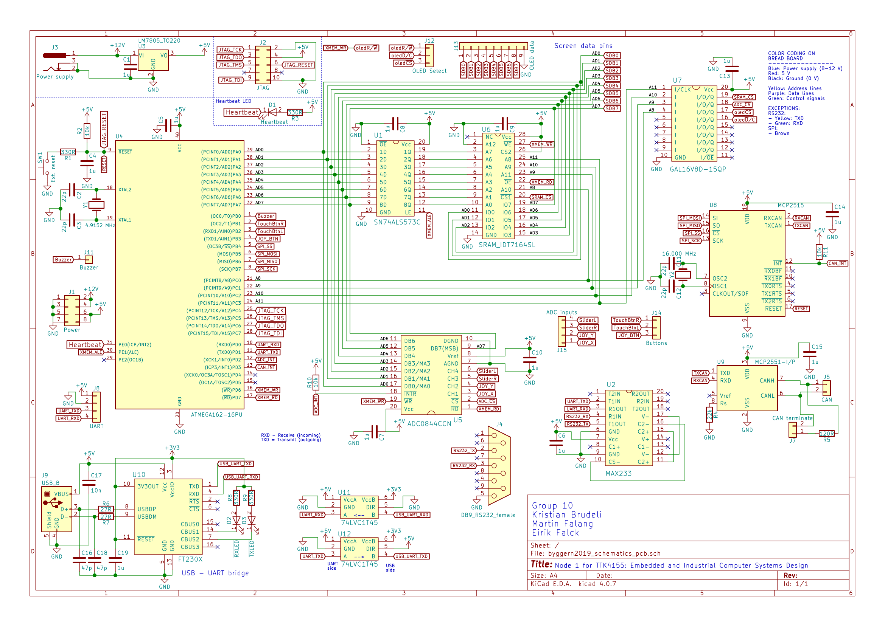
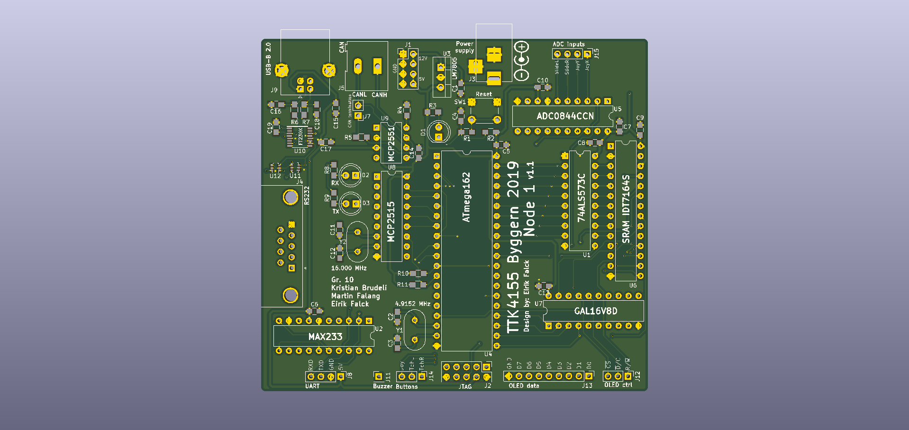

# TTK4155-Group10-ByggernPCB
The PCB files for the NTNU course Byggern (TTK4155 - Embedded and Industrial Computer Systems Design). 

# Schematic

# PCB Render

## Notes

USB module doesn't work. 
